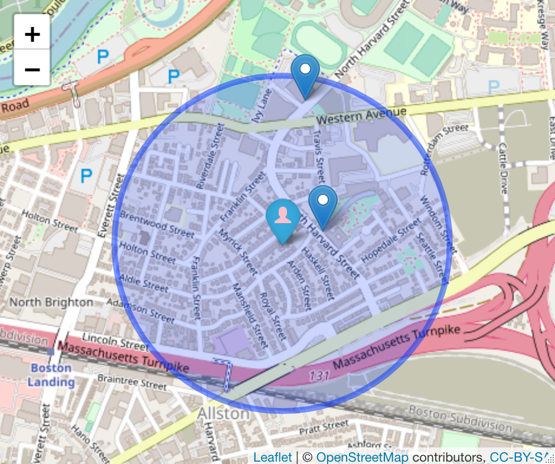

<!-- README.md is generated from README.Rmd. Please edit that file -->

```{r, include = FALSE}
knitr::opts_chunk$set(
  collapse = TRUE,
  comment = "#>",
  fig.path = "man/figures/README-",
  out.width = "100%"
)
```

# bluebike R package

<!-- badges: start -->

[](https://lifecycle.r-lib.org/articles/stages.html#experimental)


[](https://github.com/zyang2k/bluebike/actions)
<!-- badges: end -->

# Summary

Our package includes data from the Boston Blue Bike trip history data acquired from the [Blue Bikes System Data](https://www.bluebikes.com/system-data). The users can import all monthly trip history data from 2020 to 2022 into a cleaned data set that can easily be used for data analysis. \
  
The package also includes a sample data set that includes 1000 sampled trip history from Feb. 2022, and a full data set that contains information about all available stations. 
  Functions inside the package:\
  
- `import_month_data`: takes in numeric year/month values and imports data for the specified time\

- `station_distance`: returns stations with distance in ascending order given the user's current location\

- `station_radius`: plots the position of the stations within walking distance (500 m), and present the basic information about the stations via leaflet\

- `trip_distance`: computes the geographical distance between the start and end stations\ 


The package would be a useful tool for the Blue Bike operations to analyze the trip data and help improve the shared bike service based on user data. It is also an easy-to-use tool for data analysis and visualization for anyone interested in the Blue Bike trip data.

## Installation

You can install the development version of bluebike from [GitHub](https://github.com/zyang2k/bluebike) with:

``` r
# install.packages("devtools")
devtools::install_github("zyang2k/bluebike")
```

## Data Sets Included

- `trip_history_sample`: a sample of 1000 trip data entries from February 2022.
- `station_data`: 

## Basic Usage

### Data Wrangling

Count the number of trips from starting stations:

```{r example, message=FALSE, warning=FALSE}
library(bluebike)
library(dplyr)

stations <- trip_history_sample %>% 
  group_by(start_station_name) %>% 
  summarize(trips_from = n())
head(stations)
```

### Data Visualization via Leaflet

Display the position of the starting stations:


```{r, message=FALSE, warning=FALSE, eval= FALSE}
library(leaflet)

BostonMap <- leaflet(data = trip_history_sample) %>% 
  addTiles() %>% 
  addCircleMarkers(lng = trip_history_sample$start_station_longitude, 
                   lat = trip_history_sample$start_station_latitude, 
                   radius = 0.1, 
                   color = "blue")

BostonMap
```

What if I want to see the trip data of Jan. 2015?
```{r}
jan2015 <- import_month_data(2015, 1)
```

We can then compute the the average distance that user traveled in Jan. 2015
```{r}
jan_distance <- jan2015 %>% 
  sample_n(1000) %>% 
  trip_distance()
mean_jan_distance <- mean(jan_distance$distance)
mean_jan_distance
```

Where can I find the closest station? 

```{r}
top_5_station <- station_distance(-71.13, 42.36) %>%
  head(5)

top_5_station
```

I would like to find all stations around me within 500 m, what should I do?


```{r}
station_500 <- station_radius(-71.13, 42.36, r = 500)

station_500
```

## Contributors

-   [Ziyue Yang](https://github.com/zyang2k)
-   [Tianshu Zhang](https://github.com/tianshu-zhang)
