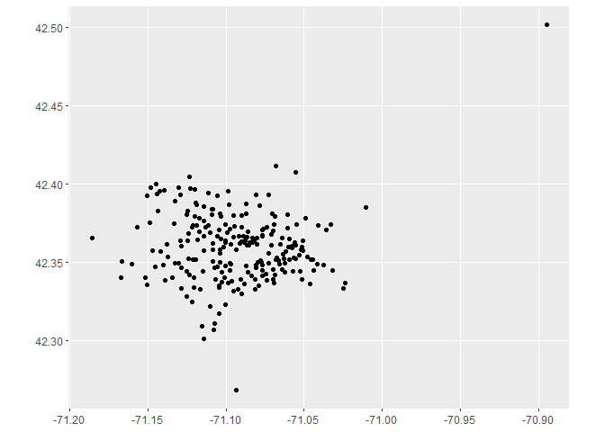
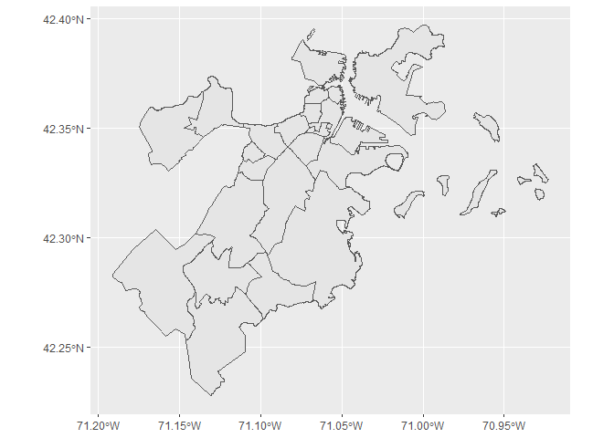

<!-- README.md is generated from README.Rmd. Please edit that file -->

# bluebike

<!-- badges: start -->
<!-- badges: end -->

Bluebike contains data from [Blue Bikes System
Data](https://www.bluebikes.com/system-data) website. It contains
monthly trip data from 2020 to 2022. The data includes the name and
geographic location of the bike stations, start and end time of the
trip, trip duration, bike id, user information. Additionally, the data
includes a random sample of 1000 trip history entries for sample
analysis and functions for importation of the full data set.

## Installation

You can install the development version of bluebike from
[GitHub](https://github.com/zyang2k/bluebike) with:

``` r
# install.packages("devtools")
devtools::install_github("zyang2k/bluebike")
```

## Sample Data Set

-   `trip_history_sample`: a sample of 1000 trip data entries from
    February 2022.

## Data Wrangling

Count the number of trips from starting stations:

``` r
library(bluebike)
library(dplyr)
stations <- trip_history_sample %>% 
  group_by(`start station name`) %>% 
  summarize(trips_from = n())
head(stations)
#> # A tibble: 6 x 2
#>   `start station name`                      trips_from
#>   <chr>                                          <int>
#> 1 1200 Beacon St                                     4
#> 2 175 N Harvard St                                   6
#> 3 191 Beacon St                                      5
#> 4 30 Dane St                                         8
#> 5 359 Broadway - Broadway at Fayette Street          6
#> 6 699 Mt Auburn St                                   1
```

## Data Visualization

``` r
library(sf)
library(ggplot2)

start_station <- st_as_sf(trip_history_sample, coords = c('start station longitude', 'start station latitude'))
neighborhoods <- st_read("data-raw/Boston_Neighborhoods/Boston_Neighborhoods.shp")
#> Reading layer `Boston_Neighborhoods' from data source 
#>   `C:\Users\Tianshu Zhang\Documents\sds270\bluebike\data-raw\Boston_Neighborhoods\Boston_Neighborhoods.shp' 
#>   using driver `ESRI Shapefile'
#> Simple feature collection with 26 features and 7 fields
#> Geometry type: MULTIPOLYGON
#> Dimension:     XY
#> Bounding box:  xmin: -71.19125 ymin: 42.22792 xmax: -70.92278 ymax: 42.39699
#> Geodetic CRS:  WGS 84
district <- st_crs(neighborhoods)
ggplot(start_station) + 
  geom_sf()
```



``` r
ggplot(neighborhoods) +
  geom_sf()
```



## Contributors

-   [Ziyue Yang](https://github.com/zyang2k)
-   [Tianshu Zhang](https://github.com/tianshu-zhang)
